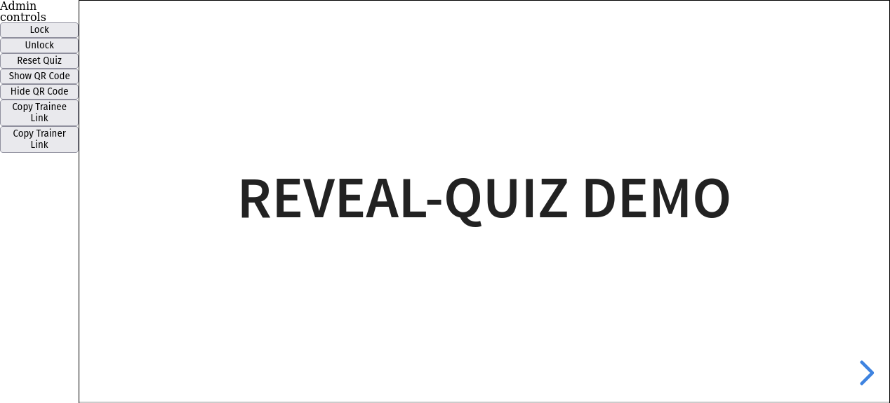

# Admin View

The admin view has the following structure:

## Slides panel

The *slides panel* is displayed on the right side of the view.

It displays the slides the same way slides will be displayed in the *Trainer View*.

When changing slides in the *slides panel*, the state of the presentation is forwarded to the *Trainee View*s.

## Controls panel

The controls panel gives access to several actions that help control the presentation and the quiz.

### Lock/Unlock

The *Lock* and *Unlock* buttons allows to lock and unlock the presentation of the *Trainee View*s.
*Unlock*ing the *Trainee View* will allow the trainees to change slides, and enable Trainee controls.
*Lock*ing the *Trainee View* will reset the *Trainee View*s to the current slide, and disable Trainee controls.

### Show/Hide QR Code

Those actions display a QR Code on the *Trainer View*, so that the *Trainee*s can join the current session by scanning it.

### Copy links

Copy Trainee Link copies to the clipboard the same URL that is displayed in the QR Code.
It can be used to send the link to the trainee to help them join the presentation.

Copy Trainer Link copies to the clipboard the URL of the Trainer View.

### Reset Quiz

Quiz status is saved in session storage for all *Trainee*s.
The *Reset Quiz* button cleans the status of the quiz for all the *Trainee*s.
